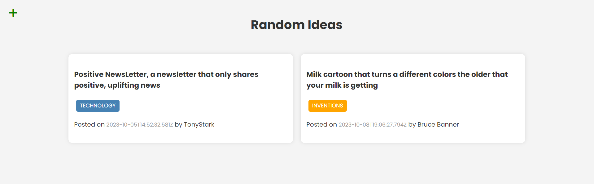

# RandomIdeas App
This is a fullstack application for sharing random ideas from Brad Traversy Course.

This app includes a Node.js/Express REST API that uses MongoDB for a database.

The client side is build with webpack.

When user wants to update or delete the idea, the idea should match with the user creator.



Install Dependencies on the front-end and back-end side
```
npm install
cd client
npm install

```

Back-end
```
npm start
```

Front-end/Webpack
```
cd client
npm run dev
```